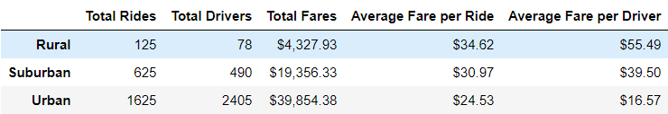

# PyBer_Analysis

## Overview of the Analysis

This challenge analyzes the rideshare data and compare the total number of rides, total number of drivers, and the average fares for each of the city types. As a result, a generalzation plot of the total fare per each city type was calculated based on the analysis.

## Results

From the summary shown in the following figurem it is clear that most rides do occur in urban cities. However, the average fare per ride and per driver are less in relative to Rural or Suburban areas. The data does reflect a correct scenario, where population density has a significant impact on the number of rides, while the traveling distance on average will have an affect on the average fare per driver and per ride. 

**Figure 1** Summary Analysis per city type 

The following graph shows a total fare amount from January 2019 to April 2019. Urban  city type shows a consistant higher fare total throughout the course of the 4 months. it is evident that PyBer will product the most amount of money and should invest and focus more on urban areas.

**Figure 2** Fare Summary 

## Summary
To addres the disparities among the city types, PyBer could increase the number of drivers for the rural areas. From the provided data, there are more drivers in urban areas than suburban and rural. PyBer could either attempt to increase the driver count in rural area, or spread out urban drivers to more suburban and rural areas. 
